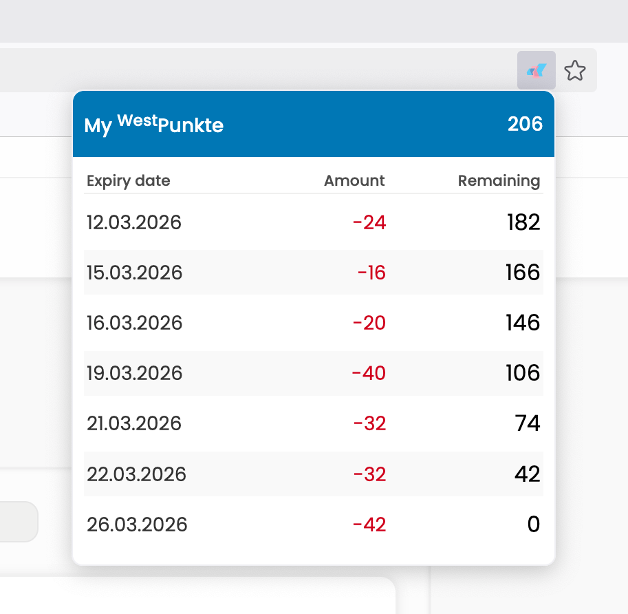

# WestPunkte Helper

WestPunkte Helper enhances the [Westbahn](https://westbahn.at) website by providing an overview of expiry dates for currently held <sup>West</sup>Punkte.



This feature is (annoyingly) missing from the official website where you'd have to go through the list of transactions manually to find the oldest transaction that's still relevant.

## Building

```sh
./build.sh
```

Then install `westpunkte-helper.xpi` in your favorite Firefox fork.

Maybe I'll distribute this on AMO some day but not right now. If you wanna upload it, go ahead.

## License

It's the MIT license. See `LICENSE.md`.

The Poppins font used to imitate the style of the official website is licensed under the SIL Open Font License. The license text is available in `poppins/OFL.txt`.
